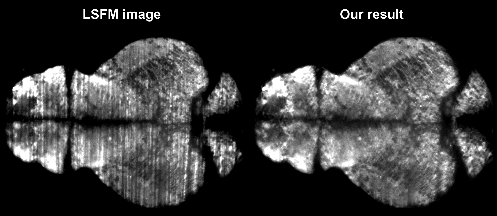
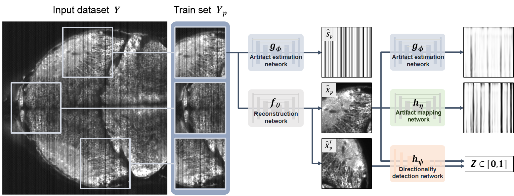

# Line artifact removal in LSFM

*Last update: 01/04/2024* <br/>
* All codes, explanation files and dataset are here: \143.248.159.179\Lab_share\01_data\Minyoung

## Goal
<p align="center">

</p>
<p align="center">

</p>
The goal is to remove the line artifacts from the LSFM (Light Sheet Fluorescence Microscopy) image. As shown in the figure above, our purpose is to create an artifact-removed image (*right*) from the synthetic (or real) LSFM image (*left*).

## Overall architecture
<p align="center">

</p>
The network consists of two main parts:

1) Line extraction path: From the given LSFM image, the line extraction network 'f' extracts the line artifact mask. The subsequent discriminator 'h' distinguishes between the generated and synthetic line artifact masks.
2) Image reconstruction path: From the given LSFM image, the reconstruction network 'g' eliminates the line artifacts and produces an artifact-removed image. The subsequent line extraction network 'f' verifies whether any line artifacts remain in the artifact-removed image.

## Dataset
* You can download the dataset in NAS **143.248.159.179** <br/>
(Lab_share/01_data/Minyoung/230118_Line_Artifact_Removal/dataset)
  
### Synthetic dataset
    dataset/
        DATASET_FOLDER/
            GT_3D.tif
            INPUT_3D.tif
            SYNTHETIC_MASK_3D.tif
            index_list.txt
            valid_gt/
                000_c0_h480_w1593.tif
                001_c0_h94_w649.tif
                ...
            valid_input/
                000_c0_h480_w1593.tif
                001_c0_h94_w649.tif
                ...

* 'DATASET_FOLDER' example: 231216_LSM_simulation_ExcludePSF
    * **GT_3D.tif**: 3D ground truth image (artifact-free confocal image)
    * **INPUT_3D.tif**: 3D input synthetic LSFM image
    * **SYNTHETIC_MASK_3D.tif**: 3D synthetic line artifact mask from the optical system simulation
    * **index_list.txt**
        * A list of indexes to obtain a valid dataset from the 3D input and GT images.
        * This code is used only for generating a valid dataset. It is not necessary for training.
    * **valid_gt**: ground truth images of the valid dataset. It is obtained by extracting patches of size 256x256 from **GT_3D.tif** using the **index_list.txt**.
    * **valid_input**: input LSFM images of the valid dataset. It is obtained by extracting patches of size 256x256 from **INPUT_3D.tif** using the **index_list.txt**.

### Real dataset
    dataset/
        DATASET_FOLDER/
            ValidDataset/
                000_c0_h303_w651.tif
                001_c0_h278_w720.tif
            INPUT_3D.tif
        synthetic_S/
            SYNTHETIC_MASK_3D.tif
* 'DATASET_FOLDER' example: 231216_LSM_simulation_ExcludePSF
    * **ValidDataset**: input LSFM images of the valid dataset.
    * **INPUT_3D.tif**: 3D input synthetic LSFM image
    * **SYNTHETIC_MASK_3D.tif**: 3D synthetic line artifact mask from the optical system simulation

## Training model
### 0. Settings
1) Please refer to **environment.yaml** for setting up the virtual environment before training.
2) Please check if **model_UNetv16.py** is located in the root directory.

**\<Files\>**
* **environment.yaml**: The information about the virtual environment used for model training is contained in this file.
* **model_UNetv16.py**: Model code used for training and testing.
* **utils_data_preprocessing.py**
    * This code can be used if you want to train the model with your custom dataset.
    * Or you can just use the custom dataset without using this code.
* **utils_LSM_simulation_python.py**
    * Code for generating synthetic line artifact masks that don't follow the laws in the optical system.
    * You can use any other code for generating the synthetic line artifact masks.

### 1-1. Synthetic dataset
If you want to train the model with the synthetic dataset so that you can compare the results with the ground truth, follow the directions below.
1) **synthetic_dataloader_3Dpre.py** should be located in the root directory.
2) Run **synthetic_train_UNetv16-1_NoPSF_G_231214.py**.
```
python synthetic_train_UNetv16-1_NoPSF_G_231214.py --in_dir 'INPUT_3D_PATH' --synthetic_S_dir 'SYNTHETIC_MASK_3D_PATH' --gt_dir 'GT_3D_PATH' --valid_idx_path 'INDEX_LIST_PATH' --out_dir 'OUTPUT_DIRECTORY'
```
* Default settings are contained in the code.
* You can adjust other settings such as the number of epochs, patch size, etc.

**\<Outputs\>**
* The intermediate results are saved in the output directory with the hyperparameter information.
    * loss_curve
        * Horizontal line plots of the generated line artifact mask and synthetic line artifact mask are saved for every valid saving period.
        * The loss curves for comparing {GT, output} and {input, output * mask} are saved for every epoch.
        * The loss curves of the losses used to train the model are saved for every epoch.
    * output_images
        * {line artifact mask, mask of GT, mask of output, output, synthetic line artifact mask} from the valid dataset is saved for every valid saving period.
    * saved_models
        * pth files of the networks are saved for every model saving period.
        * 'Discriminator_for_S.pth', 'UNet_for_S', and 'UNet_for_X' denote the network 'h', 'f', and 'g', respectively.
    * temp
        * A summary of the results from the valid dataset is saved for every valid saving period.
        * In each image, the meaning from the first row is as follows: {input image, synthetic line artifact mask, generated line artifact mask, mask of GT, mask of output, GT, output, colormap of GT(_green_) and output(_red_)}

### 1-2. Real dataset
If you want to train the model with the real dataset that doesn't contain the ground truth, follow the directions below.
1) **dataloader_3Dpre.py** should be located in the root directory.
2) Run **train_UNetv16-1_G_231214.py**.
```
python train_UNetv16-1_G_231214.py --in_dir 'INPUT_3D_PATH' --synthetic_S_dir 'SYNTHETIC_MASK_3D_PATH' --valid_dir 'VALID_DATASET_PATH' --out_dir 'OUTPUT_DIRECTORY'
```
* Default settings are contained in the code.
* You can adjust other settings such as the number of epochs, patch size, etc.

**\<Outputs\>**
* The intermediate results are saved in the output directory with the hyperparameter information.
    * loss_curve
        * Horizontal line plots of the generated line artifact mask and synthetic line artifact mask are saved for every valid saving period.
        * The loss curves of the losses used to train the model are saved for every epoch.
    * output_images
        * {line artifact mask, mask of GT, mask of output, output, synthetic line artifact mask} from the valid dataset is saved for every valid saving period.
    * saved_models
        * pth files of the networks are saved for every model saving period.
        * 'Discriminator_for_S.pth', 'UNet_for_S', and 'UNet_for_X' denote the network 'h', 'f', and 'g', respectively.
    * temp
        * A summary of the results from the valid dataset is saved for every valid saving period.
        * In each image, the meaning from the first row is as follows: {input image, synthetic line artifact mask, generated line artifact mask, mask of GT, mask of output, GT, output, colormap of GT(_green_) and output(_red_)}

## Testing model
1) You can obtain the output artifact-removed image for the large test data. ('Large' means bigger than the patch size used for training.)
2) Run **test_UNetv16-1_231215.py**.
```
python test_UNetv16-1_231215.py --in_dir 'INPUT_3D_PATH' --modelUNet_for_S_path 'NETWORK_f_PTH_PATH' --modelUNet_for_X_path 'NETWORK_g_PTH_PATH' --out_dir 'OUTPUT_DIRECTORY'
```
* Default settings are contained in the code.
* You can adjust other settings. _opt.patch_ means the size of the patch for testing, and _opt.pad_ means the size of the padding to consider the receptive field of the network.
3) If you want to calculate PSNR or SSIM, use **PSNR_SSIM.py**.

**\<Additional files\>**
* **previous_models**: Just for recording (not used for training or testing), previous version codes.
